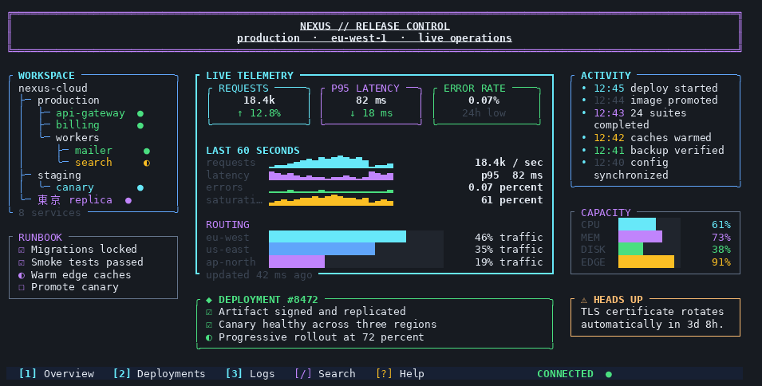
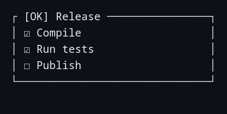
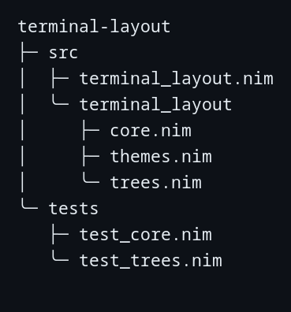
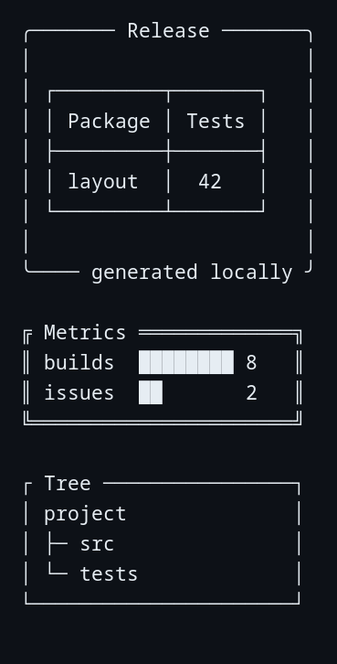
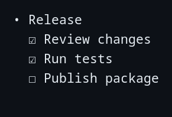
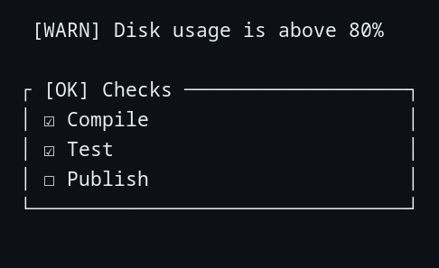
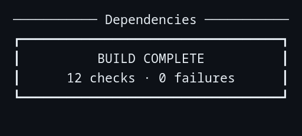
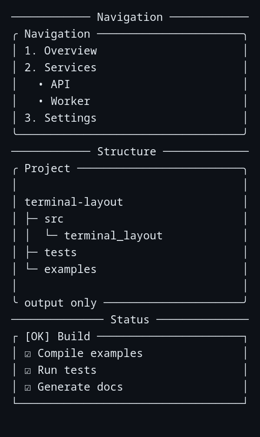
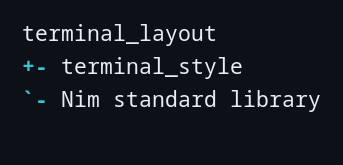
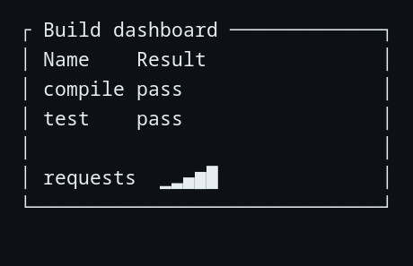

# TerminalLayout

[](https://github.com/titanomachy/terminal-layout/actions/workflows/ci.yml)

TerminalLayout is the output-only structural layer of the Nim terminal suite.
It provides generic trees, panels, cards, nested lists, reusable indentation,
semantic callouts, and non-semantic banners. Renderers return
deterministic strings; importing the package or constructing a value never
prints, queries the terminal, or mutates terminal state.

Requires Nim 2.0.0 or newer and
[TerminalStyle](https://github.com/titanomachy/terminal-style) 0.1.1 or newer.

## Full TUI showcase

TerminalLayout components can be combined into complete application screens,
while TerminalStyle supplies RGB color and ANSI-aware measurement for custom
composition. This 118-cell release dashboard nests panels, a tree, task and
activity lists, metric cards, callouts, Unicode charts, capacity bars, and a
status bar. Its renderer returns each complete frame without querying or
taking control of the terminal; the streaming entry point performs the redraw
shown here:



Run the complete [TUI showcase](examples/tui_showcase.nim):

```sh
nim r --path:src examples/tui_showcase.nim
```

Or run the deterministic, simulated-live
[streaming showcase](examples/streaming_tui_showcase.nim):

```sh
nim r --path:src examples/streaming_tui_showcase.nim
```

Press Ctrl+C to stop the stream. The example restores text attributes, cursor
visibility, and the main screen before exiting. Pass `--once` to render the
finite loop used for the animation. The
[source asciicast](docs/recordings/streaming-tui-showcase.cast) was recorded
locally with Asciinema and converted with Agg using JetBrainsMono Nerd Font
Mono; no account or network data source is required. A
[static snapshot](docs/images/tui-showcase.png) is also available.

A process cannot clean up after an uncatchable termination such as `kill -9`.
If that leaves a terminal in the alternate screen or with a hidden cursor,
Linux and macOS users can run `reset`. In PowerShell, including PowerShell in
Windows Terminal, the equivalent recovery is:

```powershell
$esc = [char]27
[Console]::Write("$($esc)[0m$($esc)[?25h$($esc)[?1049l")
Clear-Host
```

That PowerShell form also works in Windows PowerShell 5.1; PowerShell 6 and
newer additionally support the shorter `` `e `` escape notation. Recovery is
a last resort, not part of normal example use.

The example includes a small side-by-side compositor built from
TerminalStyle's `displayWidth` and `padAnsi` helpers. The same pattern can
arrange any strings returned by TerminalLayout—or by another terminal library.

## Install

```sh
nimble install terminal_style
nimble install terminal_layout
```

Nimble installs TerminalStyle from the declared package dependency. For an
unreleased checkout, clone the repository and run `nimble install` from its
root after making TerminalStyle 0.1.1 available.

## Quick start

Models and renderers are ordinary Nim values and functions. This example
builds a task list, renders it in plain mode, and uses the resulting string as
the body of a semantic callout:

```nim
import terminal_layout

let checks = [
  listItem("Compile").withTaskState(taskChecked),
  listItem("Run tests").withTaskState(taskChecked),
  listItem("Publish").withTaskState(taskUnchecked)
]

let checklist = taskList(checks, initListOptions(useColor = false))
echo success(checklist, title = "Release", width = 32,
  useColor = false).render()
```



The screenshot shows the rendered task list nested directly inside the
success callout. See the compilable
[quick-start example](examples/quick_start.nim) for the same workflow.

```sh
nim r --path:src examples/quick_start.nim
```

## Component gallery

| Component | Construct with | Render with | Useful for |
|---|---|---|---|
| Tree | `tree`, `initTreeNode` | `renderTree`, `render` | Hierarchies and caller-built directory views |
| Panel/card | `initPanel`, `initCard`, `card` | `renderPanel`, `render` | Width-aware string composition |
| List | `listItem` | `bulletList`, `numberedList`, `taskList` | Ordered, nested, and semantic task lists |
| Callout | `info`, `warning`, `failure`, `success` | `renderCallout`, `render` | Semantic status messages |
| Banner | `initBanner`, `banner` | `renderBanner`, `render` | Non-semantic headings and announcements |

Constructors validate their inputs, and renderers validate exported object
fields again. The `$` convenience uses the configuration stored in a tree,
panel, callout, or banner model; lists render an ordered item collection.

## Trees and hierarchies

Construct nested literals with `tree` and render them without side effects:

```nim
import terminal_layout

let project = tree("project",
  tree("src", tree("main.nim"), tree("render.nim")),
  tree("tests", tree("test_render.nim")))

echo project.render(theme = roundedTreeTheme)
```

```text
project
├─ src
│  ├─ main.nim
│  ╰─ render.nim
╰─ tests
   ╰─ test_render.nim
```



The screenshot is produced by the same caller-built hierarchy; TerminalLayout
only lays out the supplied nodes and preserves their order.

`TreeNode` is an ordinary value model, so runtime construction preserves the
caller's insertion order:

```nim
var root = initTreeNode("services")
root.add "api"
root.addChild tree("workers", tree("email"), tree("billing"))

echo renderTree(root, theme = asciiTreeTheme)
```

The built-in `unicodeTreeTheme`, `roundedTreeTheme`, and `asciiTreeTheme`
presets apply no color by default. `initTreeTheme` and `customTreeTheme` accept
custom one-cell connectors plus independent connector, label, and pruning
styles. Nodes can override their own label and incoming-connector styles with
`withStyle` and `withConnectorStyle`.

Tree options make structural behavior explicit:

```nim
let options = initTreeOptions(
  showRoot = false,
  overflow = overflowWrap,
  wrapMode = wrapWords,
  useColor = false,
  lineEnding = "\n"
).withWidth(32).withMaxDepth(3)

echo renderTree(project, options)
```

- Width is the complete outer line width. Prefix columns consume part of it,
  and labels wrap or truncate in the remaining terminal cells.
- Explicit and wrapped continuation lines use hanging indentation under the
  label column.
- Visible top-level nodes have depth zero. Every omitted descendant branch is
  replaced with `pruneMarker`; descendants are never silently discarded.
- A single tree has no connector before its visible root. Forest roots and the
  children of a hidden root are connected with tee/elbow branches.
- `useColor = false` strips ANSI already present in labels and suppresses theme
  and node styles.
- Rendering never mutates `TreeNode` values or appends a line ending.

The [tree example](examples/trees.nim) manually models a directory, JSON-like
data, and a dependency hierarchy. TerminalLayout deliberately does not walk
the filesystem or parse JSON on the caller's behalf.

```sh
nim r --path:src examples/trees.nim
```

## Panels and cards

Panels are width-aware composition containers for arbitrary text and rendered
TerminalLayout, [TerminalTable](https://github.com/titanomachy/terminal-table),
or [TerminalGraph](https://github.com/titanomachy/terminal-graph) output. Width
is always the complete outer width, including border columns and horizontal
padding:

```nim
let report = initPanel(
  "Builds: 8\nFailures: 0",
  width = 32,
  padding = initPanelPadding(top = 1, right = 2, bottom = 1, left = 2),
  theme = doublePanelTheme)
  .withTitle("CI report", alignCenter)
  .withFooter("main", alignRight)

echo report.render()
```



The panel example applies these same width, border, title, and padding rules to
card, metric, graph, and nested-tree content.

`squarePanelTheme`, `roundedPanelTheme`, `heavyPanelTheme`,
`doublePanelTheme`, `asciiPanelTheme`, and `borderlessPanelTheme` provide named
presets. `initPanelTheme` and `customPanelTheme` validate custom one-cell
borders before rendering. Each `Panel` stores independent body, title, footer,
and border styles plus body and label alignments.

`initCard` returns the same `Panel` model with rounded borders and one cell of
padding on every side; `card` is its concise convenience form. Fluent helpers
can change titles, footers, width, padding, theme, content alignment, overflow,
color, and line endings without mutating the original value.

- Body text wraps by default or truncates each explicit line when
  `overflowTruncate` is selected. Every emitted row is padded to the outer
  width in visible terminal cells. Already-fitting rows retain leading spaces,
  preserving the structure of rendered trees, lists, tables, and graphs.
- A bordered title or footer has one separator cell on each side when its
  horizontal run has at least three cells. Colliding labels are truncated by
  complete styled graphemes and never replace the corners.
- Empty bodies produce one body row. Top and bottom padding always produce the
  exact requested number of blank rows.
- `useColor = false` strips ANSI already present in the body and labels and
  suppresses panel styles.
- Borderless panels keep the same width, padding, alignment, title, and footer
  contract while omitting the enclosing rules.
- Rendering never mutates `Panel` values or appends a line ending.

The [panel example](examples/panels.nim) composes representative table and
graph strings, plus a rendered tree, without taking TerminalTable or
TerminalGraph as production dependencies.

```sh
nim r --path:src examples/panels.nim
```

## Lists and indentation

`ListItem` is an ordered recursive value model used by bullet, numbered, and
task lists. Concise literals and immutable configuration helpers keep nested
structures readable:

```nim
let navigation = [
  listItem("Project",
    listItem("Install"),
    listItem("Verify",
      listItem("Linux").withTaskState(taskUnchecked),
      listItem("macOS").withTaskState(taskChecked)
    ).withChildKind(listTasks)
  ).withChildKind(listNumbers),
  listItem("Release")
]

echo bulletList(navigation)
```

```text
• Project
  1. Install
  2. Verify
    ☐ Linux
    ☑ macOS
• Release
```



The screenshot shows how numbered and task-list children keep their text
aligned beneath an ordinary bullet-list parent.

`renderList` accepts `ListOptions` and a `ListTheme`. The `bulletList`,
`numberedList`, and `taskList` conveniences select the top-level `ListKind`;
nested levels inherit that kind unless their parent uses `withChildKind`.
Unchecked, checked, and indeterminate task states use visible glyphs in plain
as well as styled output.

```nim
let procedure = [
  listItem("Install Nim"),
  listItem("Run nimble test"),
  listItem("Publish")
]

let options = initListOptions(
  startingNumber = 8,
  delimiter = ")",
  overflow = overflowWrap,
  useColor = false
).withWidth(24)

echo numberedList(procedure, options)
echo indent("details\nnext line", 4)
```

- Ordered markers are right-aligned within each sibling group, so item text
  remains aligned when numbering crosses from 9 to 10.
- Wrapped and explicit continuation lines use hanging indentation under the
  item text. Nested levels add `indentation` cells per depth.
- Optional width is a maximum complete outer line width; shorter rows are not
  padded and no trailing spaces are added by list rendering.
- Unicode and ASCII themes supply validated one-cell bullet and task markers.
  Custom delimiters may occupy more than one cell but must be plain, visible,
  and single-line.
- `useColor = false` strips ANSI from item text, suppresses marker/body styles,
  and keeps semantic task markers visible.
- `indent` safely handles ANSI state and multiline LF/CRLF content while
  adding an explicit number of leading cells.

The [list example](examples/lists.nim) includes a checklist, numbered
procedure, mixed nested navigation, and generic indentation.

```sh
nim r --path:src examples/lists.nim
```

## Semantic callouts

Callouts give status messages a visible semantic marker while reusing panel
geometry. Built-in constructors cover information, warnings, failures/errors,
and success:

```nim
let checks = taskList([
  listItem("Compile").withTaskState(taskChecked),
  listItem("Publish").withTaskState(taskUnchecked)
], initListOptions(useColor = false))

echo success(checks, title = "Release checks", width = 32,
  useColor = false).render()
echo warning("Disk usage is above 80%", width = 32,
  presentation = calloutCompact).render()
```



Both presentations retain the semantic marker: boxed callouts add panel
structure, while compact callouts keep the message visually lightweight.

`CalloutKind` records semantic intent independently from presentation.
`calloutBoxed` delegates to the ordinary panel renderer; `calloutCompact` uses
a borderless panel, retaining the same complete outer width, padding,
wrapping/truncation, ANSI, and LF/CRLF behavior.

The named `infoCalloutTheme`, `warningCalloutTheme`,
`failureCalloutTheme`, and `successCalloutTheme` palettes are explicit and do
not inspect environment or terminal settings. `initCalloutTheme` and
`customCalloutTheme` accept a visible label, optional validated one-cell icon,
plain marker, panel preset, and independent marker/body/border styles.

- Styled output uses the theme icon when present and falls back to its textual
  label when omitted.
- Plain output always uses a marker such as `[INFO]`, `[WARN]`, `[FAIL]`, or
  `[OK]`, strips input ANSI, and suppresses theme styles.
- An optional contextual title follows the semantic marker; narrow rendering
  may truncate that context or body but never the semantic marker itself.
- Multiline strings and already-rendered trees, lists, tables, or graphs can
  be callout bodies. Rendering does not mutate `Callout` values or append a
  line ending.
- `calloutCustom` requires an explicit theme, keeping palette selection local
  and deterministic.

The [callout example](examples/callouts.nim) builds boxed, compact, custom, and
nested-list status reports as ordinary strings without a logging dependency.

```sh
nim r --path:src examples/callouts.nim
```

## Banners

Banners emphasize application titles, section headings, and announcements
without implying semantic severity. The concise `banner` constructor creates a
centered rule banner; `initBanner` exposes subtitles, alignment, padding,
themes, styles, color behavior, and LF/CRLF output:

```nim
echo banner("Dependencies", width = 36).render()

let summary = initBanner(
  "BUILD COMPLETE",
  width = 36,
  theme = heavyBannerTheme,
  textStyle = initTerminalStyle(attributes = {taBold}),
  fillStyle = initTerminalStyle(foreground = colorGreen))
  .withSubtitle("12 checks · 0 failures")

echo summary.render()
```



The screenshot pairs the lightweight rule form with a boxed announcement built
from the same banner model.

`plainRuleBannerTheme`, `boxedBannerTheme`, `heavyBannerTheme`,
`doubleBannerTheme`, and `asciiBannerTheme` provide named presets.
`initBannerTheme` and `customBannerTheme` validate custom one-cell fill glyphs
and panel borders before rendering.

- Rule mode fills every output row to the exact complete outer width. Padding
  separates non-empty text from the rule; empty and vertical-padding rows are
  complete rules.
- Left, center, and right placement is measured in terminal cells. Centered
  odd spare space puts the extra cell on the right deterministically.
- Boxed themes delegate border, padding, alignment, truncation, and outer-width
  geometry to panels rather than maintaining another box renderer.
- Multiline text is supported and an optional subtitle follows its lines.
  Fitting uses complete ANSI-aware grapheme clusters, so CJK, combining marks,
  emoji, and styled input are not split.
- `useColor = false` strips input ANSI and suppresses text/fill styles.
  Rendering never mutates `Banner` values or appends a line ending.

The [banner example](examples/banners.nim) demonstrates section headings, a
styled build summary, and a plain application title. Large-font/FIGlet output
remains intentionally outside the package scope.

```sh
nim r --path:src examples/banners.nim
```

## Composition

Every renderer returns an ordinary string, which is the integration boundary
between TerminalLayout components and the wider terminal suite. For example, a
nested list can become a panel body without adapters or extra dependencies:

```nim
import std/options
import terminal_layout

let navigation = [
  listItem("Home"),
  listItem("Project", listItem("Source"), listItem("Tests"))
]

let body = bulletList(navigation,
  initListOptions(useColor = false).withWidth(28))

echo initPanel(body, width = 32, title = some("Navigation"),
  useColor = false).render()
```



The complete example extends the same string-composition pattern across every
component, with each outer renderer retaining control of its own width.

Already-rendered children retain nested whitespace when their rows fit. The
outer component owns its own width and color policy: setting its
`useColor = false` strips ANSI embedded by any child while preserving semantic
markers and Unicode-cell geometry.

The [all-layouts example](examples/all_layouts.nim) composes nested lists in a
panel, a tree in a card, a task list in a callout, and banner section
separators. `nimble suiteIntegration` additionally checks actual sibling
TerminalTable and TerminalGraph output in both directions when those
repositories are present beside TerminalLayout; they remain test-only and are
not production dependencies.

```sh
nim r --path:src examples/all_layouts.nim
```

## TerminalStyle customization

The façade re-exports TerminalStyle, so styles and visible-cell helpers do not
need a second import. Component themes keep structural, semantic, and content
styles independent:

```nim
let accent = initTerminalStyle(
  foreground = colorCyan,
  attributes = {taBold})

let theme = customTreeTheme("+", "`", "|", "-",
  connectorStyle = accent,
  labelStyle = initTerminalStyle(foreground = colorWhite))

echo tree("terminal_layout", tree("terminal_style")).render(theme = theme)
```



This output uses custom structural glyphs and styles while keeping measurement
and plain-mode behavior identical to the built-in themes.

Custom border, connector, marker, and fill glyphs must contain no ANSI and
occupy exactly one visible cell. Styles belong in the corresponding style
fields. See [customization.nim](examples/customization.nim) for styled and
plain renderings of the same model.

```sh
nim r --path:src examples/customization.nim
```

## Dependency rationale and interoperability

TerminalLayout depends directly on TerminalStyle because every component must
measure visible cells and safely wrap, truncate, pad, and strip text containing
ANSI controls or multi-code-point graphemes. Sharing those primitives prevents
the terminal-suite packages from disagreeing about geometry.

TerminalLayout does not depend on TerminalTable or TerminalGraph. Their
renderers return strings, and those strings are accepted as panel, card, or
callout bodies. Conversely, a rendered tree or list can be placed in a table
cell. [interoperability.nim](examples/interoperability.nim) demonstrates that
boundary without adding either sibling package as a dependency.

```sh
nim r --path:src examples/interoperability.nim
```



The screenshot demonstrates that rendered table and graph strings remain
ordinary panel content; TerminalLayout does not need component-specific
adapters.

```text
TerminalStyle
  ├── TerminalTable
  ├── TerminalGraph
  └── TerminalLayout
```

## Foundation API

The façade also exports the shared foundation and complete TerminalStyle API:

- `LayoutWidth` is a validated positive outer width in terminal cells.
- `LayoutInsets` stores non-negative top, right, bottom, and left space.
- `OverflowMode` makes wrapping or truncation explicit.
- Horizontal alignment reuses TerminalStyle's `TextAlignment` values:
  `alignLeft`, `alignCenter`, and `alignRight`.
- `splitLayoutLines`, `joinLayoutLines`, and `normalizeLineEndings` preserve
  empty and trailing lines, accept CRLF input, and emit validated LF or CRLF.
- `unicodeLayoutGlyphs` and `asciiLayoutGlyphs` centralize one-cell border,
  tree, list, callout, and banner characters.

For example:

```nim
let
  width = initLayoutWidth(40)
  insets = initLayoutInsets(top = 1, right = 2, bottom = 1, left = 2)
  lines = splitLayoutLines("first\r\nsecond")

doAssert width.cellCount == 40
doAssert insets.horizontalInset == 4
doAssert displayWidth("界") == 2
doAssert joinLayoutLines(lines) == "first\nsecond"
```

Run the complete [foundation example](examples/foundation.nim):

```sh
nim r --path:src examples/foundation.nim
```

## Rendering contract

TerminalLayout components follow these package-wide rules:

- Rendering returns a string without an appended trailing line ending.
- Width means visible terminal cells, not UTF-8 bytes or code points.
- ANSI controls, combining marks, CJK characters, and emoji are measured with
  TerminalStyle.
- Plain rendering strips existing ANSI controls and does not apply styles.
- Invalid dimensions, insets, line endings, and one-cell glyphs fail with
  `ValueError` before partial output is produced.
- ASCII output is selected explicitly; the package performs no locale, TTY,
  color, or terminal-width detection.

## Defaults at a glance

| Setting | Default | Meaning |
|---|---|---|
| Panel/card/callout width | 40 cells | Complete outer width, including borders and padding |
| Banner width | 40 cells | Complete rule or boxed width |
| Tree/list width | unconstrained | Add a positive cell limit with `withWidth` |
| Overflow | `overflowWrap` | Wrap at words unless another `WrapMode` is selected |
| Line ending | LF (`"\n"`) | CRLF (`"\r\n"`) is the only alternative |
| Color | enabled | Set `useColor = false` to strip input ANSI and suppress styles |
| Output terminator | none | Renderers never append a final LF or CRLF |

Panel and callout content has one blank cell of horizontal padding by default.
Cards add one cell on all four sides. List nesting adds two cells per depth,
and tree connector columns occupy three cells by default. Named Unicode themes
are the defaults; ASCII themes are always selected explicitly.

## Modules

- `terminal_layout/core` contains shared validation, sizing, overflow, and
  multiline behavior.
- `terminal_layout/themes` contains component-neutral Unicode and ASCII glyph
  presets.
- `terminal_layout/trees` contains the generic tree model, builders, themes,
  options, validation, and deterministic renderer.
- `terminal_layout/panels` contains panel/card models, padding, themes,
  validation, fluent configuration, and deterministic rendering.
- `terminal_layout/lists` contains recursive list items, bullet/number/task
  themes and options, deterministic rendering, and generic indentation.
- `terminal_layout/callouts` contains semantic callout models, explicit
  palettes, convenience constructors, validation, and panel-backed rendering.
- `terminal_layout/banners` contains banner models, rule/box themes,
  validation, immutable helpers, and deterministic rendering.
- `terminal_layout` re-exports every stable module and `terminal_style`.

## Development

```sh
nimble test
nimble examples
nimble docs
# Complete local release gate:
nimble releaseCheck
# From the terminal-suite workspace, with sibling repositories available:
nimble suiteIntegration
```

Compile any example from the repository root with the checkout's `src`
directory on Nim's module path:

```sh
nim c --path:src examples/foundation.nim
nim c --path:src examples/trees.nim
nim c --path:src examples/panels.nim
nim c --path:src examples/lists.nim
nim c --path:src examples/callouts.nim
nim c --path:src examples/banners.nim
nim c --path:src examples/all_layouts.nim
nim c --path:src examples/quick_start.nim
nim c --path:src examples/customization.nim
nim c --path:src examples/interoperability.nim
nim c --path:src examples/tui_showcase.nim
nim c --path:src examples/streaming_tui_showcase.nim
```

Use `nim c -r --path:src ...` to compile and immediately run an example, or
run `nimble examples` to type-check the complete set without creating example
executables.

`nimble docs` generates the API reference in `htmldocs/`. The shared fixtures
cover ANSI, CJK, combining-mark, emoji, empty, multiline, and CRLF input. The
tree, panel, list, callout, banner, and composition suites add exact snapshots,
validation/contract checks, seeded width properties, Unicode/ANSI geometry and
style-reset coverage, plain nested-output checks, and input non-mutation
checks.

Release-contract tests additionally compile and exercise the public façade,
documented defaults, TerminalStyle re-exports, color disabling, and LF/CRLF
rules. Example compilation acts as a documentation smoke test; `nimble docs`
checks all public `##` comments through Nim's documentation generator.

See [CONTRIBUTING.md](CONTRIBUTING.md) for change requirements,
[RELEASING.md](RELEASING.md) for the clean-environment and tagging checklist,
[THIRD_PARTY_NOTICES.md](THIRD_PARTY_NOTICES.md) for dependency notices, and
[CHANGELOG.md](CHANGELOG.md) for user-visible changes.

## Deliberately out of scope

TerminalLayout does not provide filesystem walking, data parsing, terminal or
color-capability detection, cursor movement, live redraw, interactive widgets,
Markdown parsing, FIGlet fonts, or direct Table/Graph adapters. Callers own I/O
and domain traversal; rendered strings remain the stable composition boundary.
